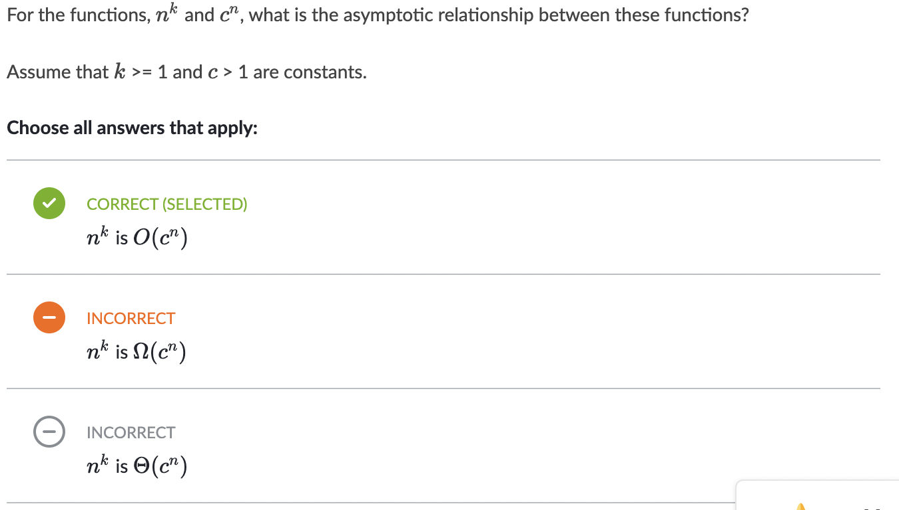

# Příprava na první test

## 1. Kouknout se na Halting Problém
- S nejvyšší pravděpodobností nebude v testu. Halting problém, neboli problém zastavení. V teorii vyčíslitelnosti jde o úlohu, ve které máme a známe zdrojový kód programu a rovněž známe i jeho vstup a naším úkolem je rozhodnout, zdali program zastaví, anebo poběží navždy bez zastavení. Roku 1936 Alan Turing dokázal, že neexistuje žádný obecný algoritmus, který by pro všechny vstupy toto dokázal rozhodnout. Pro nás jde tedy o nerozhodnutelný problém.

## 2. Kouknout se na [Gödelovy věty o neúplnosti](https://cs.wikipedia.org/wiki/G%C3%B6delovy_v%C4%9Bty_o_ne%C3%BAplnosti)
- Nemělo by se také objevit v testu

## 3. Kouknout se na to, jak funguje Turingův stroj a co to je

### **Shrnutí kurzu z Turingova stroje**

#### What is true for the finite-state machine?
- it can be in exactly one of a finite number of states at any given time
- it switches between the states based on the symbols from the input
- it only remembers the current state

#### What is required for the algorithm to meet the Church-Turing thesis?

- be able to be done by a person with a paper and pencil
- do not require human intelligence for launch
- consist of a finite number of instructions
- always return a result after a finite number of steps

#### What is true for the deterministic and non-deterministic finite-state machine?

- Deterministic finite-state machine - Contains exactly one target state in each location in the table.
- Non-deterministic finite-state machine - Has a whole set of states in each location in the table.

#### What parts does the Turing machine consist of?

- processor unit
- infinite strip of tape
- program

#### Which of the following programming languages are considered Turing complete?
- JavaScript
- Java
- Ruby

#### The Turing machine is used for modeling __.
- algorithms in computability theory

#### A multi-tape Turing machine can be fully replaced by a single-tape Turing machine.
- Yes

#### For the transition between states, the __ is used. 
(transition function - Table)

## 4. Co je deterministický a nedeterministický Turingův stroj
- Deterministický konečný automat obsahuje v každém místě tabulky právě jeden cílový stav.
O nedeterministickém konečném automatu hovoříme tehdy, pokud přechodovou funkci definujeme tak, že v každém bodě tabulky není jeden cílový stav, ale celá množina stavů. Automat při přečtení jednoho symbolu ze vstupu přechází současně do všech stavů této množiny stavů. Ze všech těchto stavů pak pokračuje čtením dalšího symbolu ze vstupu. Vstup pak takovýto nedeterministický automat přijme, je-li alespoň jeden stav prvkem množiny přijímacích stavů a automat v takovém stavu zůstane.

## 5. 100% se podívat na definici velkého O a vůbec celou třídu složitosti

### Příklady ke složitostem algoritmů

1. 
2. 
3. 
4. 
5. 
6. 
7. 
8. 
9. 
9. 
5. otazky na typ- aka je zlozitost prepend do array a)O(1) b)O(n)
a podobne
najzlozitejse co tam bolo bolo nieco ako ze mas priority queue|2357 kde | je front a prioritu maju sude cisla a kde sa bude nachadzat 6ka ked ju pridas odpoved je |26357
ale nejakej otazke som mal chybu a stve ma ze neviem v akej
lebo mam pocit ze som to tam nahadzal spravne
3. 

### Co si zapamatovat
1. 
2. 
3. 

### Shrnutí kurzu ze složitostí

#### Arrange asymptotic complexities in ascending order.

- log
- quadratic
- cubic
- Expo

#### Let's have an algorithm A with running time 
n +1000 and an algorithm B with running time 4n, where n is the number of input data. Which algorithm in terms of time complexity is more suitable for its low value n(n<5)?
- B

#### How do we mark the asymptotic complexity of an algorithm?

- O(f(N))

#### Arrange the asymptotic complexities in ascending order

- O(1), O(log), O(n^2), O(n!)

#### ___ is in fact the division of algorithms into complexity classes

Asymptotic complexity

#### With constant complexity, the amount of input data __ matter and the processing time will be __.

- DOES NOT
- WILL BE THE SAME

#### Let's have an algorithm A with running time 
n+1000 and an algorithm B with running time 4n, where n is the number of input data. Which algorithm in terms of time complexity is more suitable for the values n∈(−∞;+∞)?

- A

## 6. Třída složitosti P 

jedná se o polynomiální alogritmus, který lze vyřešit deterministickým Turingovým strojem

## 7. NP Úplný problém -nastudovat
NP (nedeterministicky polynomiální) je množina problémů, které lze řešit v polynomiálně omezeném čase na nedeterministickém Turingově stroji, který umožňuje v každém kroku větvit výpočet na N větví, ve kterých se pak současně hledá řešení.

## 9. SAT problém

## 10. Pochopit dva loupežníky

## 11. Barvení grafu třema barvama tak, aby žádný sousední stát neměl stejnou barvu

## 12. Problém obchodního cestujícího

## 13. PSpace třída
- Evidentně se jedná o třídu, která se dá vyřešit deterministickým algoritmem za použití prostorové složitosti.
## 15. pochopoit onen vzorec F(n) =< c*g(n)
- 
## 16. Odvoďte si jestli x*six(x) patří do lineární nebo kvadratický složitosti

# Základní datové struktury - Spojový seznam
 1. Jeho funkce a jakou bude mít složitost
 2. Rozdíl v čase mezi pole, a seznam, když se třeba přidává prvek, nebo odebírá
 3. Pole vs. Seznam
## Asymptotická složitost spojového seznamu
- přidání a mazání prvku je O(1)
- mazání prvku může být se složitostí O(n), pokud se nejedná o aktuální prvek a je nutné ho nejprve vyhledat
- náhodný přístup k prvku a vyhledání prvku O(n).
- Výhody spojových seznamů spočívají především v teoreticky neomezené kapacitě a v rychlosti přidávání prvků, velikost paměti je závislá na počtu prvků. 
- Nevýhodou je pomalý náhodný přístup k prvkům, protože je nutné na daný prvek přeskákat od začátku, pokud se nejedná o aktuální prvek, jehož adresu si pamatujeme v pomocné proměnné. Stejné množství dat zabírá v paměti obvykle více místa, než je tomu u Pole, protože musíme udržovat i adresy na následující prvky. Uložené prvky nejsou v paměti organizovány za sebou, tedy dochází k fragmentaci paměti, což ale oproti poli může být i někdy naopak výhoda (pole obvykle vyžaduje souvislé volné bloky paměti, které nemusí být dostupné). Obecně jsou spojové seznamy pomalejší při procházení, neboť při každém skoku na následující prvek je nutná dereference adresy a skok na dané místo v paměti.
9. 

# Základní datové struktury - Pole
## 1. Jakou složitost má "remove" v poli? (a nebo jeho další funkce)
Zde se podívat, jakou složitost má práce s polem - v knize to není, to by mohla být kurvárna

# Základní datové struktury - Zásobník
 1. používá se pro ně pole a spoják
 2. Udržují nějak data, jak je čsto potřebujeme
 3. Co je zásobník? - první patrona je vystřelena jako poslední LIFO
 4. Základní operace push (prepend jako seznam, append jako pole) a pop

## Operace zásobníku
- create, push, pop, top, isEmpty, size

 Opět - jak je to s asymptotickou složitostí?

# Základní datové struktury - Fronta
1. FIFO
2. Fronta - queue vloží prvek na konec - lze implementovat seznamem
3. Dequeue - odebere první prvek ve frontě a vrátí jeho hodnotu
4. Co je prioritní fronta

## operace fronty
- create, addLast (enqueue), removeFirst (dequeue), getFirst (peek/first), isEmpty, size

# Binární čísla
## 1. Srát na to - nebude to v testu

# Hashování!!!
## 1. tohodle tam bude 3 prdele, fakt to nastudovat
## 2. Jak funguje
## 3. Kolize - jaký je mechanismus - na dané políčko vložím spojovací seznam
## 4. Nebo to vyřeším další hashovací funkcí
## 4. Faktor zaplnění
## 5. Co když máme plno?

# Třídění bude asi na 100% v testu taky

1. Jaké jsou vlastnosti třídění
2. Selection Sort O(n^2)
3. Insertion Sort O(n) - nejlepší případ (když je utříděná posloupnost), jinak O(n^2)
4. Bubble Sort O(n) - nejlepší případ (když je utříděná posloupnost), jinak O(n^2)
5. V ústní zkoušce bude na 100%, proč má quick sort tu konkrétní složitost

- 

### Selection Sort
- 
### Insertion Sort
- 
### Bubble Sort
- 
### Merge Sort
- 
### Quick Sort
- 
### Heap Sort
- 

Je to 25% šance, že tam bude otázka na pseudokód