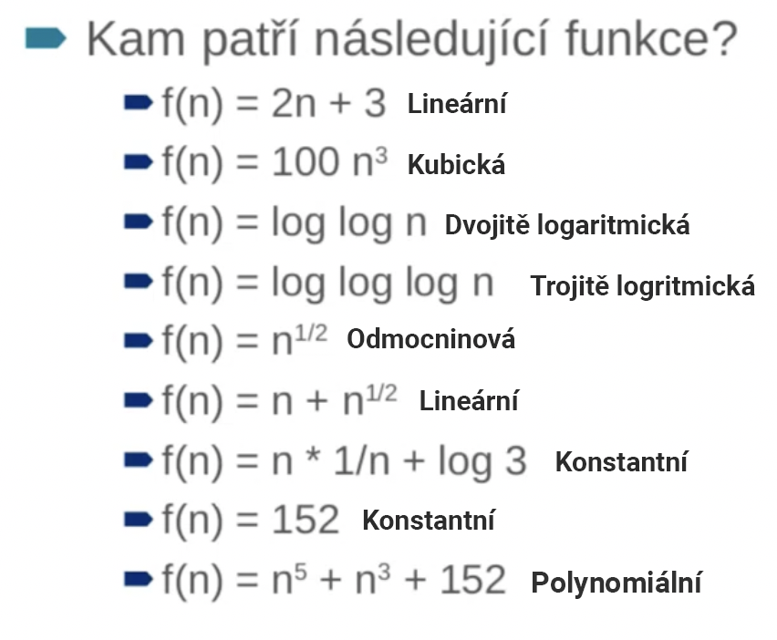

# Shrnuti prvního tutoriálu - kombinované studium, SW dev

Kontakt: [jaroslav.huss@gmail.com](mailto:jaroslav.huss@gmail.com)

---
## Matematická analýza

Čeká nás test na příštím tutoriálu, který bude na 60 minut a bude se výhradně týkat příkladů z níže uvedených materiálů.

- [Stáhnout cvičení 00](../MatematickaAnalyza/cviceni_00_priklady.pdf)
- [Stáhnout cvičení 02](../MatematickaAnalyza/cviceni_02_priklady.pdf)
- [Ukázka závěrečného testu](../MatematickaAnalyza/MA-ZK-1.pdf) *nebude v testu*

## Doučování by Honza Dobis

- [Elementární funkce](../MatematickaAnalyza/elementarni_funkce.pdf)
- [Příklady na Limity](../MatematickaAnalyza/priklady_limita.pdf)
- [Řešené příklady](../MatematickaAnalyza/resene_priklady.pdf)
- [Odkaz na video (sharepoint)](https://unicorncollege.sharepoint.com/sites/Matematika-douovn/Shared%20Documents/Forms/AllItems.aspx?FolderCTID=0x0120005B45BA74CD277B4EA84B0C24CCFD8AF4&id=%2Fsites%2FMatematika%2Ddouovn%2FShared%20Documents%2FGeneral%2FLimity%2Flimity%20cca%202h%20%2D%20vysv%C4%9Btlen%C3%AD%2030min%20priklady%2090min%2Emkv&parent=%2Fsites%2FMatematika%2Ddouovn%2FShared%20Documents%2FGeneral%2FLimity)

**zdroje**
- [kniha](https://uuos9.plus4u.net/uu-bookkitg01-main/78462435-863352904d2548a2a05653e925b08c93/book/)

## Cloudová architektura
[Seznam deadlinů a kurzů](https://uuapp.plus4u.net/uu-dockit-maing02/4e68298f1658473e9bf5692272883290/document?documentId=602e79f1b7a25900251ebf08&fbclid=IwAR3V7qYudxfMelOMYXyTJ6WqljIE9xdZSuNJJQ7hUOJK8P2ZuaNXNcPqVkk)
Je potřeba sestavit tým o 4 lidech

- [Výběr projektu je zde](https://uuapp.plus4u.net/uu-bookkit-maing01/e962bac6fb5a4b5a82b0e761ac50146c/book/page?code=03887370)

V příštím tutoriálu nás čeká jeden test z algoritmů za **20 bodů**. Další test za **20 bodů** se ještě stále neví a bude to oznámeno *opět díky Katce za opravu*.

Když z výše uvedených **40 bodů** nezískáme 60% (24b), budeme poslání k ústní zkoušce. Ale z úst přednášejícího bylo poznat, že na ústní zkoušku fakt nechceme (je to 20 minut, člověk musí umět úplně všechno). 

Ještě nás čeká test za **10 bodů** z teorie SW Achritektury *(Díky Káťo za opravu!)*

Co se testu z alga týče, tak není jisté, jestli se to bude psát v course kitu nebo na papír. Přednášející si nebyl jistý.

**Když člověk vyfailuje i ústní zkoušku z algoritmů, tak vyfailuje celý předmět za 12 kreditů**

- [Přednáška co bude v testu je zde](https://unicorncollege.sharepoint.com/sites/BCAAMSWA-ArchitekturacloudovchaplikacSoftwarovarchitekturaLt/Shared%20Documents/Forms/AllItems.aspx?id=%2Fsites%2FBCAAMSWA%2DArchitekturacloudovchaplikacSoftwarovarchitekturaLt%2FShared%20Documents%2FKombinovan%C3%A1%20v%C3%BDuka%20%2D%20T1%2FRecordings%2FArchitektura%20cloudov%C3%BDch%20aplikac%C3%AD%20%2D%20Tutori%C3%A1l%202%2D20210307%5F124051%2DZ%C3%A1znam%20sch%C5%AFzky%2Emp4&parent=%2Fsites%2FBCAAMSWA%2DArchitekturacloudovchaplikacSoftwarovarchitekturaLt%2FShared%20Documents%2FKombinovan%C3%A1%20v%C3%BDuka%20%2D%20T1%2FRecordings)

Příklady k procvičení jsou vzaty z prezenčního studia

### Seznam course kitů ke Cloudové architektuře

- [x] [App Business Model](https://uuos9.plus4u.net/uu-coursekitg01-course/99923616732453117-936da1d832b04bc8985d59cdb3cd452e/course/courseMenu) Do 29.3.2021 [Správné odpovědi](https://docs.google.com/document/d/1JDAqLQDcCOyy18yhJryHp7tjVz3aJdg8elk750Tqzds/edit?usp=sharing)
- [ ] [Business Request Man](https://uuapp.plus4u.net/uu-coursekit-courseg01/0fa38966f4344a33ac2380ad2f37ce7c/course/courseIntro) Do 26.3.2021
- [ ] [App Business Model Kit](https://uuapp.plus4u.net/uu-coursekit-courseg01/812290c630364fabbab45ae77cde6bfc) - Nevím do kdy, ale udělal bych to taky do 26.3.2021